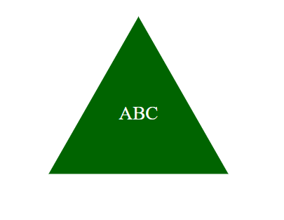

# SVG Logo Maker

## Description
Creates a 3 letter logo of your choice of 3 shapes and 3 colors.

## Table of Contents
- [Installation](#installation)
- [Usage](#usage)
- [Credits](#credits)
- [License](#license)
- [Features](#features)
- [Tests](#tests)
- [Contact](#contact)

## Installation
Inquirer, Jest.

## Usage
Run the application with node.js in the terminal.

## Credits
Jason Cano

## Features
Generates 3 types of logo, triangle, square, and circle. 

## Tests
Run 'npm test' in the terminal.

## Contact
If there are any questions of concerns, I can be reached at:
##### [github: jasoncano1](https://github.com/jasoncano1)
##### [email: jasoncano0509@gmail.com](mailto:jasoncano0509@gmail.com)
